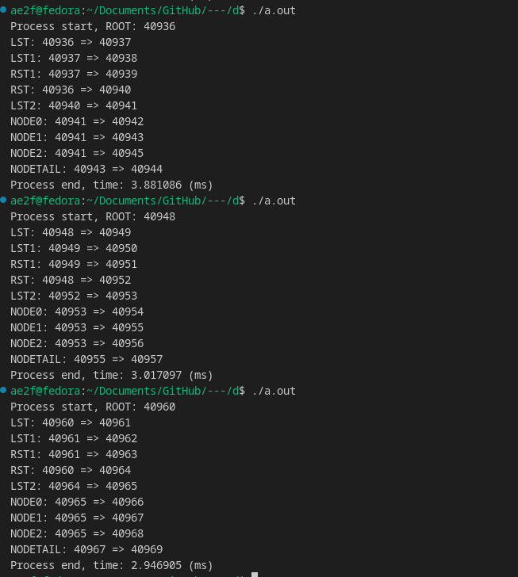
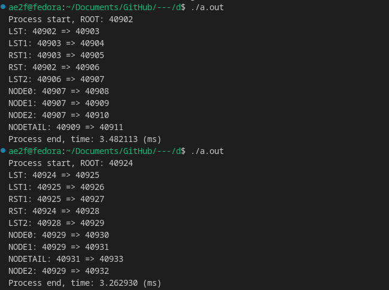
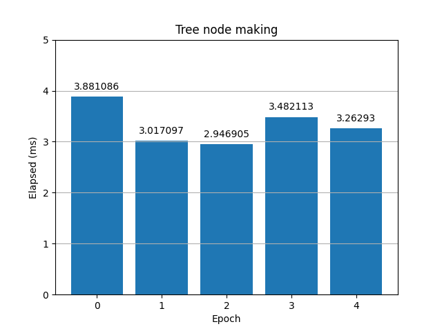

# Process
- has unique ID of its own. [pid]
- is the unit of single programme flow, which is on memory.
- parallel running is disabled.

# fork():
- is a system call in Linux, not in Windows.
- creates a new process[child].
- copies the exact state[parent] and give it to new process[child].
- Two processese [parent, child] will run separately.

## Parent Process
- The process that calls `fork()`.

## Child Process
- Newly created process by `fork()`.

# Uses
- Parallel executions of tasks.
- To make the programme not blocked by the tasks independent to the main process and heavy.

## Example: web server
- Handling a request of clients which are independent (like get).

# Danger: Zombie process
- Occurs given the parent process end without waiting for the child process's end.

## Prevent: `wait()`
- The parent is able to call `wait()` to prevent the zomie process.
- Blocks the process until the one of the children processes comes to end.
- Returns the id of the process which came to end.
- Returns -1 when no child process has found.

# Programme writing
> Write Linux program using fork() to prepare an unbalanced-tree with left-sub-tree (LST) containing 3 nodes and right-sub-tree (RST) containing 6 nodes. See process-tree in figure. 

> Measure total execution time and plot graph (X axis: instances of execution (execute 5 times of your program)
and Y axis: measured execution time for each instance of execution)


Summary of the tree:
```
ROOT
    ㄴLST
        ㄴLST1
        ㄴRST1
    ㄴRST
        ㄴLST2
            ㄴNODE0
            ㄴNODE1
                ㄴNODETAIL
            ㄴNODE2
```

I decided to manually controll the flow, so this is how I made this.
```c
#include <stdio.h> 
#include <stdlib.h>
#include <unistd.h> // for fork, pids, things
#include <time.h>   // for time getting
#include <wait.h>   // for... wait().
```

> If the process is not root or not  
> 0 when current process is root.
```c
int nroot = 0;
```


> give process a nickname
> 
> execute the fork().
>
> prints to stdout as tagname, pid(current), pid(parent for current).
>

> zero if current is child.  
> otherwise will be parent.
```c
pid_t mkproc(const char *name) {
    pid_t pid = fork();
    if (pid < 0) {
        perror("fork failed\n");
        exit(1);
    } else if (pid == 0) { // Child process
        printf("%s: %d => %d\n", name, getppid(), getpid());
        nroot = 1; // now the process is not root process
    }

    return pid; 
}
```

> Waits them all.  
>
> if it is not root, process will be terminated.  
>
> for beginner's safety.
```c
void waitall() {
    while(wait(0) != -1);

    // since it is not a root process, the process shall meet the end
    if(nroot) return exit(0); 
}
```


> just making left subtree
```c
void LST() {
    if(!mkproc("LST")) {
        mkproc("LST1") && mkproc("RST1");
    }

    waitall();
}
```

```c
/// @brief 
/// just making right subtree
void RST() {
    if(mkproc("RST")) goto end;
    if(mkproc("LST2")) goto end;
    if(!mkproc("NODE0")) goto end;
    
    mkproc("NODE1") ? mkproc("NODE2") : mkproc("NODETAIL");

    end:
    waitall();
}
```

```c
#define NS_TO_MS 1000000.0
```

```c
int main() {
    struct timespec start, end;
    double elapsed;

    timespec_get(&start, TIME_UTC);

    printf("Process start, ROOT: %d\n", getpid());
    LST(); RST();

    timespec_get(&end, TIME_UTC);
    printf("Process end, time: %lf (ms)\n", (double)(end.tv_nsec - start.tv_nsec) / NS_TO_MS);

    return 0;
}
```

## The result for each iteration



## The summary graph
